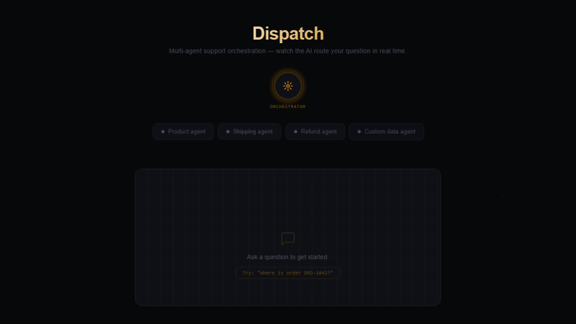

# Dispatch

**Multi-agent support orchestration POC** — watch the AI route your question to the right specialist in real time.

Ask a question. The orchestrator analyses it, picks the right agent, and you see the decision happen live — chips pulse while routing, then the chosen one snaps into focus.

---

## Demo



---

## Try these questions

| Question | Routes to |
|---|---|
| `What is the status of order ORD-1042?` | Shipping agent |
| `Can I return order ORD-1044?` | Refund agent |
| `Do the hiking boots come in wide fit?` | Product agent |
| `What are your opening hours?` | Custom data agent |
| `Has Sofia's refund been processed?` | Refund agent |

---

## Setup

```bash
# Install dependencies
npm install

# Add your LLM API key (see Configuration below)
echo "LLM_API_KEY=your_key_here" > .env

# Run (dev mode, no build)
npm run dev

# Or build and run
npm run build && npm start
```

Open `http://localhost:3000`.

---

## Configuration

This project uses a pluggable LLM backend. To swap in your preferred model:

1. **Add your API key** to `.env`
2. **Update the model** in `src/agents/orchestrator.ts` — replace the model ID with your chosen one
3. **Update each agent** in `src/agents/` — same model ID swap

Any LLM with a chat/completion API works. The orchestrator expects a JSON response with a `routes` array; the agents stream plain text.

---

## Architecture

```
POST /api/chat
    │
    ▼
orchestrator.ts  ──→  LLM decides which agent(s)
    │
    ├──→ productAgent.ts    (products, specs, pricing)
    ├──→ shippingAgent.ts   (tracking, delivery times)
    ├──→ refundAgent.ts     (returns, cancellations)
    └──→ customDataAgent.ts (company info, hours)
```

Responses stream back via **Server-Sent Events**. Each SSE event drives the chip animation:

- `routing { status: "thinking" }` → all chips pulse
- `routing { status: "decided" }` → chosen chip snaps, others dim
- `agent_answer` → answer streams in with "Routed to: X" label

Agents that handle order-specific questions (shipping, refund, product) receive the full `data/orders.csv` injected into their system prompt. No database — the LLM finds the relevant row naturally.

**Stack:** Node.js · TypeScript · Express · Vanilla JS
